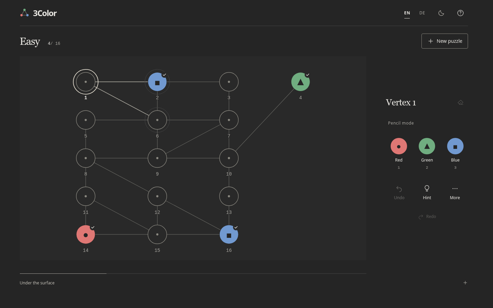

# 3Color

**3Color** is a graph colouring puzzle game built around verified reasoning. The
goal is to colour every vertex red, green or blue so that connected vertices
always have different colours.

The project treats exact solvability, uniqueness, human reasoning and player
difficulty as separate problems. The repository contains an exact solver, a
deduction engine, planar puzzle generation, independent certification, a Spring
Boot API, a Svelte frontend, and optional PostgreSQL puzzle supply.

**[Play the standalone browser version on itch.io](https://archada.itch.io/3color)**



## Contents

* [Build and run](#build-and-run)
* [How to play](#how-to-play)
* [Puzzle model](#puzzle-model)
* [Reasoning and difficulty](#reasoning-and-difficulty)
* [Generation and certification](#generation-and-certification)
* [Tests and benchmarks](#tests-and-benchmarks)
* [Standalone browser version](#standalone-browser-version)
* [Architecture](#architecture)
* [Project history](#project-history)
* [Future directions](#future-directions)
* [License](#license)

## Build and run

3Color requires Java 21 and Node 20.19 or newer, or Node 22.12 or newer. The
Gradle wrapper and npm lockfile are included.

For development, start the API and frontend separately:

```sh
# Terminal 1, repository root
./gradlew :api:bootRun
```

```sh
# Terminal 2, repository root
cd web
npm ci
npm run dev
```

Open [localhost:18373](http://localhost:18373).

No database is required. The bundled puzzle collection is checked during startup,
which can take a few minutes on slower machines.

The REST API runs on [localhost:18380](http://localhost:18380), with Swagger at
[localhost:18380/swagger-ui.html](http://localhost:18380/swagger-ui.html).

To build the frontend and packaged application:

```sh
(cd web && npm ci && npm run check && npm test && npm run build)
./gradlew test :api:bootJar
java -jar api/build/libs/three-color.jar
```

The packaged application serves both the browser game and API on port 18380.

For Docker, PostgreSQL, background discovery and public deployment, see
[`docs/DEPLOYMENT.md`](docs/DEPLOYMENT.md).

## How to play

Each vertex receives one of three colours. Two connected vertices may never have
the same colour. Checked vertices are fixed clues and cannot be changed.

Select a vertex and use the colour buttons or **1, 2, 3**. The keys **Q, W, E**
toggle red, green and blue pencil marks. Pencil marks can record possibilities
such as a vertex being red or blue while its exact colour is still unknown.

**Delete** or **Backspace** clears a vertex. Colouring a vertex removes its pencil
marks.

Arrow keys move between neighbouring vertices. **Ctrl or Cmd + Z** undoes a move,
**Ctrl or Cmd + Shift + Z** redoes it, and **H** opens a hint.

Progress, pencil marks, undo history, language and theme are stored locally in
the browser.

The game uses five size ranges:

* **Mini**, 4 to 13 vertices
* **Small**, 14 to 23 vertices
* **Medium**, 24 to 33 vertices
* **Large**, 34 to 43 vertices
* **Very large**, 44 to 53 vertices

Very easy and Easy support all five ranges. Medium and Challenging begin at
Small.

## Puzzle model

A puzzle is based on a simple graph

$$
G=(V,E)
$$

and a colouring

$$
c:V\rightarrow\{R,G,B\}.
$$

A colouring is valid when every edge connects vertices of different colours,

$$
(u,v)\in E \Longrightarrow c(u)\neq c(v).
$$

The puzzle fixes colours for only part of the graph. These vertices are the
givens. A puzzle is accepted only when the givens have exactly one valid
extension using the named red, green and blue colours.

`ExactSolver` checks this independently of the reasoning system. A puzzle can
have a unique solution without having a useful human solution path.

Each puzzle also carries a planar layout. Final certification checks both the
logical puzzle and its geometry.

## Reasoning and difficulty

Difficulty is based on explicit deductions rather than exact search effort.

`DeductionEngine` works with colour domains and relations between vertices. Its
proof trace records each rule, its affected vertices, its premises and the
evidence for its conclusion. The hint system and reasoning inspector use the same
trace information.

The player explanation model is versioned as `PLAYER_V1` and stored explicitly in
the puzzle. The reasoning vocabulary therefore does not depend on which generator
created the graph.

`ProofLevels` classifies puzzles through progressively stronger closures.

**P0** uses direct adjacency. Fixed colours eliminate possibilities from
neighbouring vertices.

**P1** adds relational reasoning, including diamond structures, locked edges,
parity deductions and relations between vertices.

**P2** adds bounded contradiction arguments. A candidate colour is assumed
temporarily, lower level rules are followed, and the candidate is removed when
the assumption produces a contradiction. All candidates in one refutation round
are tested from the same logical snapshot before that round is committed.

The player sees four categories.

**Very easy** puzzles are solved at P0.

**Easy** puzzles require P1.

**Medium** puzzles require bounded contradiction reasoning with relatively small
explanations.

**Challenging** puzzles use the same mathematical proof level as Medium, but
require more or larger contradiction arguments within the accepted explanation
limits.

The proof classifier can distinguish deeper sequential refutation work
internally. The public categories are separate from that raw classification.

These labels describe a verified reasoning path, not an empirically calibrated
measurement of human difficulty.

## Generation and certification

Puzzle generation is bounded and seeded. A request specifies a difficulty, a size
range and optionally a seed.

`RangeGenerator` first checks the available puzzle bank. If no suitable puzzle is
available, it creates or edits planar graph structures and passes them into the
main search. `DeletionGenerator` explores graph and clue candidates within
explicit work budgets.

A candidate becomes playable only through `CertifiedPuzzle`. Final verification
starts again from immutable puzzle data rather than trusting intermediate
generator state.

Certification requires:

* the player explanation model
* a clue count within the configured limit
* valid planar geometry
* a complete explanation trace
* the requested player category
* exactly one labelled solution
* the requested proof band

The final uniqueness check has a budget of 200,000 search nodes. Proof
classification has a budget of 20,000 states per level. Exhausting a budget is
treated as unknown, never as successful verification.

A bounded generation attempt may therefore return no puzzle. The application can
retry with another seed without weakening the requested category.

## Tests and benchmarks

The Java tests cover graph models, exact solving, deduction rules, proof levels,
generation, layouts, certification, hints and regression cases.

Property tests use jqwik across generated inputs. SAT4J provides an independent
solver for cross checks against parts of the exact solver.

The API tests cover HTTP behaviour, puzzle supply and PostgreSQL discovery,
including transactional updates and worker leases.

The frontend uses Vitest for TypeScript logic and Playwright for browser tests.
The browser suite covers generation, solving, hints, undo and redo, persistence,
keyboard controls, responsive layouts, mobile sizes, themes and both interface
languages.

Run the Java tests with:

```sh
./gradlew test
```

Run the frontend checks with:

```sh
cd web
npm ci
npm run check
npm test
npm run build
```

After building the packaged application as described above, run the browser
suite with:

```sh
cd web
npx playwright install chromium
npm run test:e2e
```

PostgreSQL test setup is documented in
[`docs/DEPLOYMENT.md`](docs/DEPLOYMENT.md).

The separate `benchmarks` module contains JMH measurements for selected core
generation and solving operations. It is not required by the correctness tests.

```sh
./gradlew :benchmarks:jmh
```

Benchmarks are intended for comparing implementations on the same machine, not
as hardware independent performance claims.

## Standalone browser version

The itch.io edition is a static build with an exported collection of certified
puzzles and the analysis data needed for hints. It does not include the Java
backend or live generation. The public repository doesn't include the release
tooling or generated demo collection used for that distribution.

The collection is finite. When every included graph in a category has been
played, the game reports that the collection is exhausted instead of silently
repeating it as new content.

The full application can search for new puzzles and can optionally use persistent
PostgreSQL supply. Deployment and discovery are described in
[`docs/DEPLOYMENT.md`](docs/DEPLOYMENT.md).

## Architecture

```text
web/
    Svelte 5, TypeScript, SVG board, game state, hints, static demo
        │
        ▼
api/
    Spring Boot REST API, bundled supply, optional persistent supply
        │
        ▼
core/
    Java 21 domain and algorithms
        │
        ├── model          graphs, puzzles, colours, layouts
        ├── solve          exact colouring and uniqueness
        ├── deduction      rules, proof traces, proof levels
        ├── difficulty     player difficulty classification
        ├── generation     graph search, clues, certification
        └── layout         planar geometry

benchmarks/
    JMH benchmarks against core
```

`core` has no Spring dependency. `api` and `benchmarks` depend on `core`.

## Project history

3Color has been developed iteratively over more than a year. It began as a much
smaller Java graph colouring game and changed substantially as earlier approaches
showed their limits.

Development included a substantial research component. I worked through papers
and technical material from graph theory, topology, category theory,
computational geometry, constraint satisfaction, SAT solving, proof systems and
procedural puzzle generation. Particular topics included planar embeddings,
3-colouring constructions, parity arguments, graph gadgets, symmetry,
compositional graph construction, deduction dependencies and the problem of
measuring human puzzle difficulty independently of solver search effort.

Previous versions included a JavaFX desktop interface, simpler graph generators,
search effort based difficulty measures and several generation strategies that
were later replaced or removed.

The current public repository is a cleaned snapshot rather than the original
development history. It contains the architecture that emerged from that process
without retaining every abandoned experiment and intermediate version.

## Future directions

Possible future work includes moving more bundled puzzle certification into the
build process, increasing the diversity of the certified puzzle supply, refining
generation strategies as well as validations and comparing the current difficulty
model with data from actual players.

The generator can also be separated further between graph construction, clue
search and final certification as generation work continues.

Changes in these areas should preserve reproducibility, bounded search, exact
verification and explainable reasoning.

## License

3Color is free software, you can redistribute it and/or modify it under the terms
of the GNU General Public License as published by the Free Software Foundation,
either version 3 of the License, or, at your option, any later version
(GPL-3.0-or-later).

It is distributed without any warranty, including the implied warranties of
merchantability or fitness for a particular purpose. See LICENSE for the full
terms.
